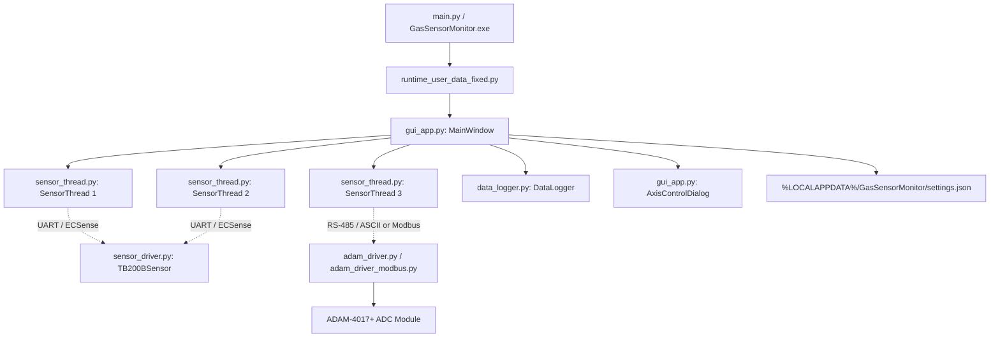

# ecSense Multi-Sensor Monitor

ecSense is a Python-based multi-threaded graphical application designed for real-time monitoring, visualization, and data logging of multiple gas sensors. Developed using PyQt6 and Matplotlib, it supports a hybrid hardware setup integrating both digital and analog sensor architectures.

---

## 🚀 Key Features

*   **Real-Time Dashboard & Visualization**:
    *   Dynamic Matplotlib canvas with two layout modes: **Combined Gas Plot** (sharing axis) or **Separate Gas Plots** (stacked vertical charts) for Gas Concentration, Temperature, and Humidity.
    *   **Popup Axis Controls & Rolling Time Window**: Independent per-sensor Y-axis limit customization (Sensor 1, 2, and 3 Gas Y Min/Max, Temp Y Min/Max, Humidity Y Min/Max) and rolling X-axis time window filtering (displaying last $N$ seconds). Automatically switches to Separate Gas Plots mode when independent gas Y-ranges are specified.
    *   Live-updating Sidebar display showing current values (ppm, °C, %RH) color-coded per sensor.
    *   Visual status labels indicating connection states (`Connected`, `Connecting`, `Disconnected`, `Error`).
*   **Dual Hardware Integration**:
    *   **ECSense (Digital)**: Direct interfacing with ECSense TB200B digital gas modules via UART (FTDI USB-to-serial).
    *   **Membrapor (Analog)**: Reading analog 4-20mA current outputs mapped to gas concentrations using the **Advantech ADAM-4017+** 8-channel ADC module over RS-485 via **Advantech ASCII Protocol** (`adam_driver.py`) or **Modbus RTU Protocol** (`adam_driver_modbus.py`).
*   **Hardware Resiliency & Concurrency**:
    *   **Singleton COM Port Sharing (`AdamManager`)**: A thread-safe management module allowing multiple analog sensors to share a single serial port/adapter without packet collision or "Access Denied" errors.
    *   **FTDI Serial Number Binding**: Prevents misconfiguration due to Windows dynamically re-assigning COM ports. The software maps configuration definitions directly to the physical FTDI chip's unique serial number.
    *   **Auto-Reconnect Loop**: Independent `SensorThread` instances running in the background automatically attempt to reconnect to hardware if a cable is unplugged, ensuring the application remains crash-free.
    *   **Auto-Discovery by Gas Type**: Scans available serial ports and queries basic metadata (`0xD1` command) to auto-bind to the correct sensor based on the desired gas type configuration.
    *   **Visual LED Identification**: Remotely toggles the sensor's physical onboard running lights to identify modules in a multi-sensor array.
*   **Configurable Data Logging & Deployment**:
    *   Saves data directly to CSV with high-resolution timestamps and relative "passed seconds" elapsed timers.
    *   Adjustable logging frequencies (1s, 5s, 10s, 30s) running on isolated timers to avoid GUI blockage.
    *   **Single-EXE PyInstaller Build System**: Supports standalone execution (`dist/GasSensorMonitor.exe`) with user data stored in `%LOCALAPPDATA%\GasSensorMonitor` via `runtime_user_data_fixed.py`.

---

## 🛠️ System Architecture & File Structure



### File Catalog
*   [main.py](file:///e:/github/transp-agk-sensorsgas/main.py): Application entry point; initializes `QApplication` and styles the GUI with the PyQt Fusion style.
*   [gui_app.py](file:///e:/github/transp-agk-sensorsgas/gui_app.py): Core graphical interface logic including tab layout, plot builders, axis range controls (`AxisControlDialog`), event-driven signal handlers, and settings persistence.
*   [sensor_thread.py](file:///e:/github/transp-agk-sensorsgas/sensor_thread.py): Implements the `QThread` background loops that query serial sensors at 1Hz and emit updates to the main GUI.
*   [sensor_driver.py](file:///e:/github/transp-agk-sensorsgas/sensor_driver.py): High/Low-level command set implementation for ECSense serial UART sensors.
*   [packet_parser.py](file:///e:/github/transp-agk-sensorsgas/packet_parser.py): Decodes binary packet frames from the UART stream and validates checks using an 8-bit checksum algorithm.
*   [adam_driver.py](file:///e:/github/transp-agk-sensorsgas/adam_driver.py): ASCII protocol driver and singleton manager (`AdamManager`) for Advantech ADAM-4017+ ADC modules.
*   [adam_driver_modbus.py](file:///e:/github/transp-agk-sensorsgas/adam_driver_modbus.py): Alternative Modbus RTU protocol driver (`Adam4017Modbus`) for ADAM-4017+ ADC modules.
*   [data_logger.py](file:///e:/github/transp-agk-sensorsgas/data_logger.py): Thread-safe file writer formatting and appending recorded readings to a CSV sheet.
*   [runtime_user_data_fixed.py](file:///e:/github/transp-agk-sensorsgas/runtime_user_data_fixed.py): Runtime initialization hook managing per-user settings and log redirection (`GasSensorMonitor.log`) in standalone `.exe` builds.
*   [BUILD_FIXED_SINGLE_EXE.bat](file:///e:/github/transp-agk-sensorsgas/BUILD_FIXED_SINGLE_EXE.bat): PyInstaller build script for creating single standalone executables.
*   [RESET_PACKAGED_SETTINGS.bat](file:///e:/github/transp-agk-sensorsgas/RESET_PACKAGED_SETTINGS.bat): Utility batch file to reset standalone executable settings to defaults.
*   `settings.json`: Configuration file that saves the last loaded sensor bindings (COM ports, serials, brands, gas types, plots, ADAM channel mappings, calibrations, and axis limits).

---

## 📖 Deep-Dive Reference Documentation

To understand communication protocols, user interface operations, and hardware specifications in detail, please refer to the following local documents:

*   📘 **[Overall GUI Architecture & Settings Guide](DOC_OVERALL_GUI.md)**: Details the design of the Main Dashboard tab, Axis Controls dialog, Settings tab, data logging fields, and internal PyQt state management.
*   📘 **[ECSense Digital Sensors Guide](DOC_ECSENSE_DIGITAL.md)**: Explains the active/passive operation modes, FTDI serial binding, auto-discovery mechanisms, and LED flash controls.
*   📘 **[Analog Sensors & ADAM-4017+ Integration](DOC_ANALOG_ADAM.md)**: Covers analog 4-20mA ADC parsing, ASCII vs Modbus protocols, the singleton `AdamManager` architecture, and calibration formulas for mapping raw voltage measurements to gas PPM.
*   📘 **[TB200B UART Communication Protocol Reference](UART.md)**: Full register, hex command, and byte-frame reference specs for command strings (mode switching, reading, query codes, and checksum logic).

---

## ⚙️ Installation & Setup

### Prerequisites
*   Python 3.8 or higher.
*   FTDI USB-to-serial drivers (usually pre-loaded on Windows, or downloadable from the FTDI chip website).
*   RS-485 serial interface drivers (for analog ADAM module support).

### Installation Steps
1.  Clone this repository or copy the directory structure into your workspace.
2.  Install all required Python libraries via pip:
    ```bash
    pip install -r requirements.txt
    ```

---

## 🚦 How to Run & Build

### Launching from Python Source
Execute the primary script to launch the GUI:
```bash
python main.py
```

### Building & Running Standalone Executable (.exe)
To package the app into a single standalone Windows executable:
1.  Run the build script:
    ```cmd
    BUILD_FIXED_SINGLE_EXE.bat
    ```
2.  The compiled executable will be output to `dist\GasSensorMonitor.exe`.
3.  Application logs and user configuration will be maintained under `%LOCALAPPDATA%\GasSensorMonitor\`.
4.  To reset settings to defaults for the executable, run `RESET_PACKAGED_SETTINGS.bat`.

### Running Diagnostics & Testing
Standalone command-line testing utilities are provided for testing hardware connections:
*   **Testing Advantech ADAM ADC Modules (ASCII Protocol)**:
    ```bash
    python adam_debug.py
    ```
*   **Testing Advantech ADAM ADC Modules (Modbus Protocol)**:
    ```bash
    python adam_debug_modbus.py
    ```
*   **Testing UART Packet Parsing (ECSense Digital Sensors)**:
    ```bash
    python debug_uart.py
    ```
